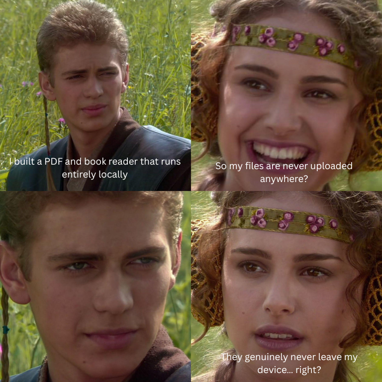

# ReadLocal



Yes. That’s literally the point.

Privacy-first multilingual PDF-to-speech, powered by Supertonic 3 and ONNX Runtime Web.

> Your documents never leave your device.
>
> PDF extraction and speech generation happen locally in your browser.

ReadLocal handles selectable-text, scanned, and mixed PDFs page by page. PDF.js extracts healthy text layers; weak pages are rendered and passed to local Tesseract OCR. Text is cleaned, segmented, language-detected, and synthesized incrementally with Supertonic—without a backend, account, analytics, cloud AI, or external TTS API.

## Features

- Byte-signature validation, 500 MB/1,000-page limits, and encrypted/corrupt PDF errors
- Range-based, per-page PDF.js extraction with automatic 300-DPI English OCR fallback
- English, Arabic, Hindi, French, Spanish, German, Italian, Portuguese, Japanese, Korean, and Chinese OCR data
- Section-level language detection, mixed-language speech, RTL layout, and manual override
- Supertonic 3 only, using WebGPU with WebAssembly fallback and eight denoising steps
- Continuous playback, pause/resume, stop, paragraph navigation, speed and voice controls
- Current sentence/paragraph highlighting, page progress, elapsed timer, and remaining estimate
- Persisted system, light, and dark themes built with Tailwind CSS v4
- IndexedDB preferences, recent history, and exact sentence resume after reselecting the same PDF
- Installable PWA; model/OCR assets cache after use when browser quota permits
- Strict same-origin CSP and no runtime third-party requests

ReadLocal supports selectable-text PDFs, scanned PDFs, mixed PDFs, RTL layout, page-level OCR fallback, mixed-language documents, manual language override, local resume, and private offline reading.

## Screenshots

Screenshots are intentionally pending until a release build is deployed. Use only generated, non-sensitive PDF fixtures when adding them.

## Architecture

The browser is the entire application. A PDF worker reads bounded file ranges, scores embedded text, and renders only failed pages; Tesseract performs local OCR, pure functions normalize the result, and a three-buffer queue feeds local Supertonic inference. The untouched source PDF remains available through a local `blob:` viewing URL. PDF bytes, extracted text, and audio remain session-only.

See [architecture](docs/ARCHITECTURE.md), [privacy](docs/PRIVACY.md), [performance](docs/PERFORMANCE.md), and [browser limitations](docs/BROWSER_LIMITATIONS.md).

## Install dependencies

Requires Node.js 22+.

```bash
npm install
```

## Download local models

Models are intentionally excluded from Git. Download them once:

```bash
npm run models:download
```

This creates ignored files under `./models`. It pins Supertonic 3 to revision `3cadd1ee6394adea1bd021217a0e650ede09a323`, Tesseract.js/core to `7.0.0`, and Tesseract trained data to `4.0.0` from the locked `@tesseract.js-data/*@1.0.0` packages.

## Configure the model directory

The default is `./models`. Use the same `READLOCAL_MODEL_DIR` value when downloading, developing, and building if you prefer another local directory:

```bash
export READLOCAL_MODEL_DIR=/absolute/path/to/readlocal-models
npm run models:download
npm run dev
```

## Run the application

```bash
npm run dev
```

## Run tests

```bash
npm run lint
npm run typecheck
npm test
npm run test:e2e
npm run build
```

Unit tests do not load the large Supertonic models. Browser OCR tests require `npm run models:download`.

## Troubleshoot missing models

If the app reports `Supertonic models are missing` or `OCR models are missing`, stop the dev server and run:

```bash
npm run models:download
npm run dev
```

For a custom directory, confirm both commands use the same `READLOCAL_MODEL_DIR`. The downloader skips files already present; it does not run automatically at startup.

Run the real defective-text regression without committing the copyrighted book by creating a small representative fixture:

```bash
qpdf ~/Downloads/48laws.pdf --pages . 2-26 -- /tmp/48laws-regression.pdf
READLOCAL_48LAWS_PDF=/tmp/48laws-regression.pdf npx playwright test -g "48laws defective"
```

`qpdf` is optional test-fixture tooling only; the application has no OS-level PDF or OCR dependency.

## Browser support

Current Chrome and Edge provide the best WebGPU path. Firefox and Safari fall back to WebAssembly where supported. OCR, model memory, storage quota, and background-audio behavior vary by device; see [browser limitations](docs/BROWSER_LIMITATIONS.md).

## Privacy model

All runtime assets are same-origin. The CSP permits connections only to the app origin. There is no analytics, telemetry, remote logging, backend, authentication, document upload, browser speech synthesis, or cloud TTS. Use the in-app “Clear local data” action to delete preferences, progress, and local history.

## Performance

Only weak pages invoke OCR. Speech is generated one sentence at a time, one upcoming sentence is prefetched, and no more than three decoded buffers are retained. Model and OCR assets are large by design; browser caching avoids repeat transfers when quota permits.

## Roadmap

- Persist optional document access through the File System Access API where supported
- Add Media Session controls and background-playback improvements
- Expand speech language coverage as local models improve
- Add release screenshots and broader real-device performance fixtures

## GitHub metadata

Recommended description: `Privacy-first multilingual PDF-to-speech reader powered by Supertonic.`

Recommended topics: `react`, `typescript`, `pdf`, `pdfjs`, `supertonic`, `onnx`, `webgpu`, `privacy`, `offline-first`, `pwa`, `accessibility`.

## Contributing and licenses

See [CONTRIBUTING.md](CONTRIBUTING.md) and [SECURITY.md](SECURITY.md). ReadLocal is MIT licensed. Supertonic browser code is MIT; downloaded model weights are OpenRAIL-M. Tesseract.js is Apache-2.0 and OCR trained data has its upstream package licensing. Review third-party terms before redistribution.
