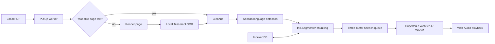

# Architecture

The browser is the complete trust boundary. `pdf.worker.ts` requests bounded `File` ranges, parses pages off the UI thread, scores each embedded text layer, and renders only rejected pages at a 300-DPI-equivalent scale. The worker waits for each OCR page to finish before rendering the next, preventing image accumulation. OCR runs through Tesseract's own worker using same-origin English data with automatic rotation.

The normalized boundary is `PdfIngestionResult`: ordered page numbers, text, `embedded-text`/`ocr` provenance, optional OCR confidence, combined text, and warnings. Cleanup, quality scoring, language detection, and chunking are deterministic testable functions. Downstream speech consumes this result; future search, summarization, or RAG should consume the same boundary rather than reparsing the PDF.

After each 5 processed pages, React receives a partial normalized result and enables reading immediately. The same worker continues with later pages and replaces that result at each batch boundary. Playback reads through a ref to the latest chunk list, so it can continue into batches that finish while audio is playing.

React owns session UI state. PDF bytes, extracted text, rendered pages, and decoded audio are not persisted. IndexedDB stores preferences, recent local filenames/fingerprints, and the current sentence index. Reselecting the same file restores that index.

`SpeechEngine` isolates model inference for tests. `SpeechQueue` deduplicates concurrent generation, prefetches one sentence, retains at most three buffers, and clears them when the document changes. Supertonic is the only production speech implementation.
