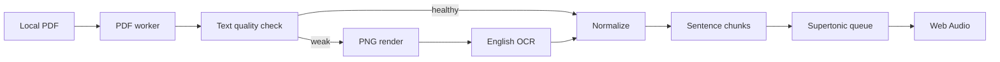

# Architecture

The browser is the trust boundary. The PDF worker reads bounded `File` ranges, parses off the UI thread, and renders weak pages at a bounded 300-DPI-equivalent scale. It waits for OCR acknowledgement before continuing, so page images do not accumulate in memory.

`PdfIngestionResult` is the application boundary: ordered pages, cleaned text, extraction provenance, and optional OCR confidence. Reading begins only after the complete result is available. Speech is split into English sentences and generated locally one sentence at a time, with one-sentence prefetch and a three-buffer cache.

The original PDF is exposed only through a local `blob:` URL. IndexedDB stores small preferences and reading metadata, never the document or generated audio.
