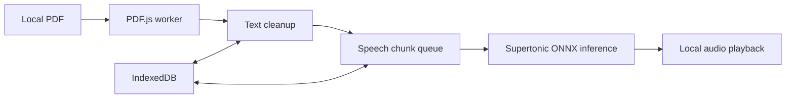

# Architecture

The browser is the whole application. A module worker owns PDF.js extraction and cleanup. React holds only the active document session; IndexedDB stores preferences and a document fingerprint plus chunk index. Audio buffers stay outside React and are released after playback. `SpeechEngine` is the only integration boundary because tests and development must not initialize large models.
